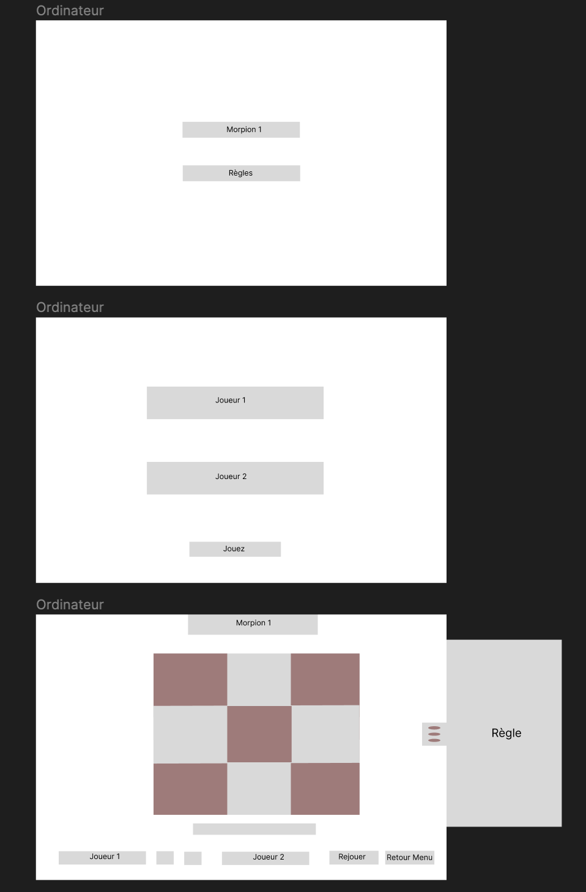
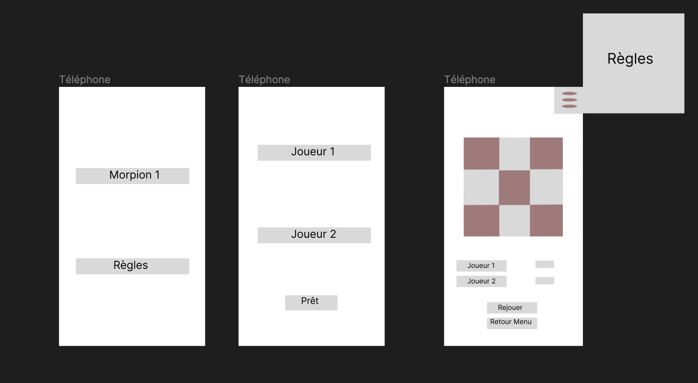
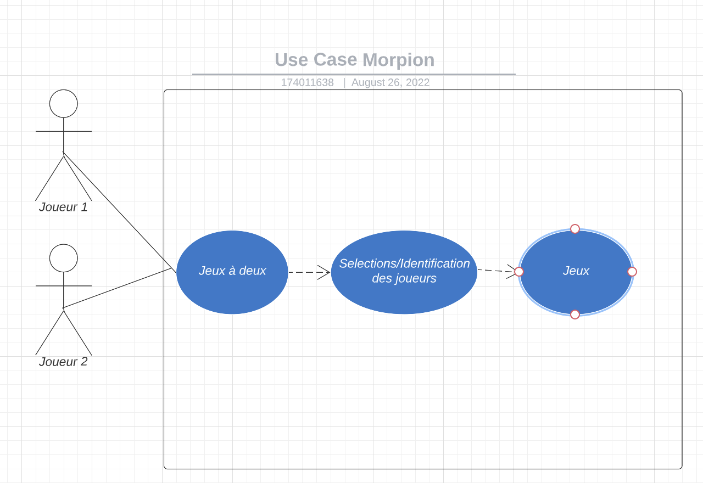

Titre DWWM : 
ECF création du jeu du Morpion dans le cadre de la découverte de Vue.js, deux versions du Morpions demandés,
Le Morpion classique et un plus évolué 

Rappel des règles Morpion V1:  
1 - Jeu qui se joue à deux joueurs, sur un damier de 3 cases par 3 cases.
2 - Chaque joueur est représenté par un "symbole"
3 - Un joueur utilise toujours le même type de "symbole"
4 - Un premier joueur dessine son symbole sur une case. Puis c'est au tour de l'autre joueur de dessiner son symbole sur une case vide.
5 - Le but du jeu est de réussir à aligner ses trois symboles (horizontal, vertical ou diagonale), on remporte alors la partie.
6 - Si la grille est remplie et qu'aucune ligne ne comporte trois symboles identiques, les joueurs finissent par un match nul.

Les deux wareframes réaliser en amont du projet : 
 
 

J'ai choisi de rester sur un design simple afin de me concentrer principalement sur le code 
et la logique. Et de me concentrer sur la version 1. 

 
J'ai fais un Use-Case pour le Morpion mais je ne sais pas ce qu'il faut vraiment mettre dans un Use-Case en Front 
Si possible réaborber brièvement cette partie là 

La Première Version sera donc composé d'un morpion, avec un joueur1 et un joueur2 sur un ordinateur en commun  ####
La partie se jouera en 5 matchs et les points seront calculés au fur et à mesure  ####
En cas d'égalité, il est possible que quelques tours soit ajoutés tant qu'il n'y a plus d'égalité  ####
Si j'ai le temps j'intègrerai des parties en 10 matchs  ####
L'idéal serait de pouvoir alterner les débuts de tours entre les deux joueurs  ####
Sur la board du jeu il pourra avoir la possibilité de retourner au menu ou encore de rejouer la partie ####